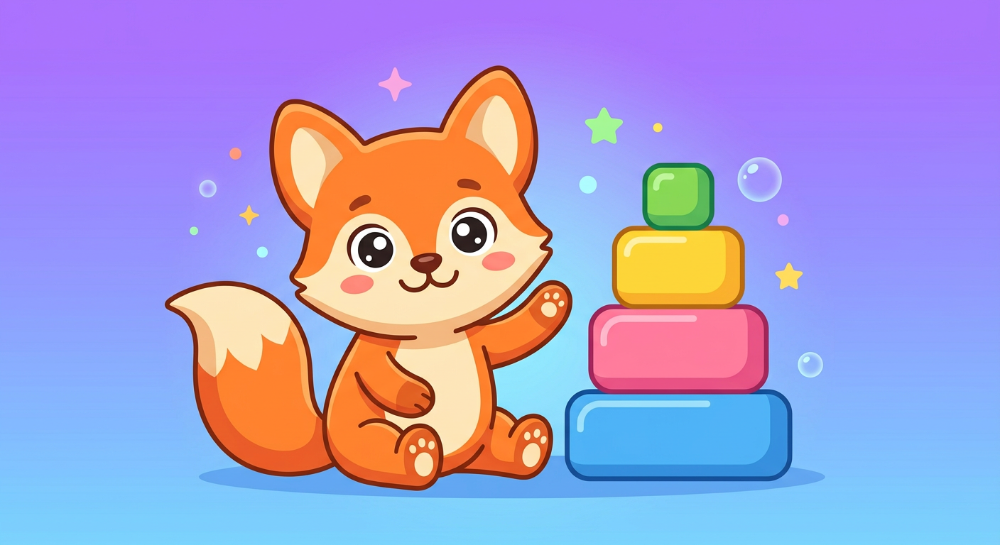

# 🦊 Koda — Learn by Making

> ## ▶️ **Play the live app:** https://mylittlestories.github.io/koda/ <br>
> The landing page (https://mylittlestories.github.io/koda/) is the front door — the app itself is at https://mylittlestories.github.io/koda/app.html

[](https://github.com/Mylittlestories/koda/actions)
[](https://github.com/Mylittlestories/koda/actions)
[](LICENSE)
[](docs/CONTRIBUTING.md)

> A friendly, **open-source, Kano-inspired** learning playground that runs entirely in your browser.
> Code games, edit photos, direct movies, train real skills, and learn how the digital world works — at your own pace, with nothing tracked and nothing to install.



Koda is **inspired by** [**Kano Computing**](https://kano.me) — the company famous for build-your-own computer kits, the block-based *Kano Code* app, and the belief that **anyone can make technology**. Koda is an independent, fan-made project that re-creates that spirit on the open web, in a single self-contained file you can read, fork, and improve.

---

## ✨ What's inside

Koda is a single-page app (`index.html` — no build step, no dependencies, no tracking) with nine worlds (including a quest game and a project gallery):

| World | Icon | What you can do |
|---|---|---|
| **Code Playground** | 🎮 | Snap color-coded blocks (motion, looks, pen & draw, control, sound), run them on a live stage, collect ⭐ stars, draw turtle-style art, and peek at the real JavaScript your blocks generate. Includes **conditionals** (`if near a star`), loops, 5 starter templates, and **10 guided coding missions** (First Steps → Robot Thinker → Master Maker). |
| **Photo Lab** | 🎨 | Upload a photo or use the sample, paint and erase, emoji stickers, captioned text, 9 filters (B&W, sepia, negative, vintage, warm, cool, pop, pixel) + brightness/contrast/color sliders, undo/redo, gallery, PNG export. |
| **Movie Studio** | 🎬 | Arrange animated scenes (sunset, bouncing ball, under the sea, rocket launch, rainbow, confetti) on a timeline, add fade-in text overlays, scrub, and **export a real video file** (.webm). |
| **Knowledge Quest** | 🧠 | **Eleven** illustrated lessons with quizzes — How Computers Think, Code & Coding Superpowers, Internet Safe Zone, Pixels & Pictures, Movie Magic, **AI for Curious Kids**, **Sound & Music in Code**, **Logic & Problem Solving**, **How the Internet Works**, **Robots & Real Coding**, **Digital Art & Design** — plus a **Brain Cards** true/false fact game (18 facts). |
| **Practice Zone** | 🎯 | Three skill drills that earn XP: **⌨️ Typing Hero** (type falling words), **➗ Math Sprint** (10 quick questions, 3 difficulties), **🧠 Pattern Master** (Simon-style memory game). |
| **Koda Forest + Caverns + Sky Temple** | 🗺️ | A sandbox adventure in **three regions**. **Forest** (18×13): golden key, 5 crystal puzzles + 2 side quests. **Crystal Caverns** 🕳️ (unlocks after forest): lava caves, rune sequences, a 5-stone bridge (the only crossing), Glow Bug Choir, the **Crystal Heart** 💗. **Sky Temple** ☁️ (unlocks after caverns): floating cloud ruins, star-stone trail ⭐, a harder **Cloud Code Master** maze 🤖, the Sky Owl quiz 🦉, and the **Golden Feather** 🪶 (+50 XP, Sky Explorer badge). |
| **My Projects** | 💾 | Your own gallery: every export is saved here with its date and content type, ready to re-open, re-download or delete — plus a **Showcase** of sample projects (Neon Dance Party, Fox Beach Trip, Rocket Launch, Sunset Postcard) you can load with one click. |
| **Make It Yours** | ⚙️ | Avatar, name, night mode, sound toggle, XP/badges, gallery, and export/import of all your progress as JSON. |

**Learning systems:** XP + levels, **21 badges**, guided missions, per-lesson progress, a **daily challenge** (new goal each day, +15 XP), a **🔥 learning streak**, a rotating mascot tip, and synthesized sound effects (WebAudio — no assets).

**🧠 Learning Journal:** solving puzzles and finishing lessons unlocks 8 concepts (Sequencing, Patterns, Debugging…) — see them on the Home page with a progress bar and tap any one to **learn more** (deep-links to the matching lesson or practice game).

**🚀 GitHub-ready:** the folder is a real git repo — see [docs/GITHUB-SETUP.md](docs/GITHUB-SETUP.md) for the copy-paste push + release commands (CI builds installers and deploys the web app to Pages automatically).

**Share your creations:** export any project (code blocks + movie timeline + photo art) as a portable **`.koda` file** — from Code, Settings or My Projects — or grab **📦 Export all (.zip)** to download every project + gallery photo in one dependency-free ZIP. The gallery shows **thumbnails** of each creation, and the **Showcase** has 8 sample projects.

**💾 Auto-save:** your code blocks, movie timeline and photo edits — **including the photo's actual pixels** (size-guarded so it can never blow storage) — are saved automatically (debounced + every 15s + on tab close) and restored when you come back.

**🎵 Adventure music:** a soft magical soundtrack (WebAudio, no files) starts on your first tap — and it's **region-aware**: the Forest plays a bright pentatonic tune, the Caverns a deep mysterious one, the Movie Studio a sparkly theme. Toggle anytime with the 🎵 button or in Settings.

---

## 🚀 Quick start

**The fastest way:** open `index.html` in any modern browser. That's it — everything is inline.

```bash
# or serve it like a real site (optional)
python3 -m http.server 8000
# then visit http://localhost:8000
```

> ℹ️ **Note on sandboxed previews:** if you open Koda inside a restricted iframe preview (like some chat/file viewers), `localStorage`, file downloads and video export may be limited — Koda detects this and falls back gracefully (progress then lives in memory). For the full experience, download `index.html` and open it in a normal browser tab.

---

## 📦 Launching Koda as a program — or an OS

Yes, this is possible — and part of it works today, because Koda is a single dependency-free file.

- **Desktop program — Linux + Windows, fully self-contained**: Electron bundles Chromium + Node inside the package and the app has zero external dependencies, so **`Koda Setup 1.0.0.exe`, `Koda-1.0.0.AppImage` and `koda-desktop_1.0.0_amd64.deb` are all built and verified in this repo** — 100% offline, no installers needed to fetch anything at runtime. macOS is out of active scope (you'd build on a Mac); the CI workflow builds Windows + Linux on every version tag → [`packaging/electron/`](packaging/electron/)
- **Native save dialogs** in the desktop app: movies (.webm), PNG art and `.koda` files save via a real *Save As* dialog (preload IPC bridge)
- **Installable app / offline PWA**: manifest + service worker → [`packaging/pwa/`](packaging/pwa/)
- **"Koda Console" on a Raspberry Pi** (the spiritual heir of Kano OS): boots straight into Koda, fullscreen, offline forever → [`packaging/os/pi-setup.sh`](packaging/os/)
- **Kiosk mode on any Linux**: one command → [`packaging/os/kiosk.sh`](packaging/os/)
- Full honest map (what's realistic vs. overkill) → [`packaging/os/README.md`](packaging/os/README.md)

---

## 🧭 How Koda maps to Kano

| Kano | Koda equivalent |
|---|---|
| Kano OS (friendly desktop) | Koda dashboard with paths, badges, streak & daily challenge |
| Kano Code (block programming) | Code Playground: loops, conditionals, live stage, missions & templates |
| Kano app store / maker kits | Photo Lab, Movie Studio, Practice Zone, Knowledge Quest |
| Kano World community | (roadmap) shareable projects via `.koda` files |
| Kano for Education / Classrooms | (roadmap) teacher mode & class packs |

Koda stays true to Kano's core ideas: **learn by making**, **progress you can see**, **colorful and friendly**, and **open so you can take it apart**.

---

## 🗂️ Project structure

```
koda/
├── index.html            # the entire app (HTML + CSS + JS, zero dependencies)
├── landing.html          # introduction landing page (site root on Pages)
├── README.md
├── CHANGELOG.md
├── LICENSE               # MIT
├── docs/
│   ├── GITHUB-SETUP.md   # push + release, one copy-paste
│   ├── BETA-INVITE.md    # copy-paste tester invites
│   ├── TESTER-FEEDBACK.md # 3-question feedback form
│   ├── RELEASE-NOTES.md   # ready-to-paste release description
│   ├── koda-logo.png
│   ├── ARCHITECTURE.md   # how the app is organized, where to add things
│   ├── CONTRIBUTING.md
│   └── smoke-test.js     # 30+ behavior assertions (node + jsdom, dev-only)
├── scripts/release.sh  # build & verify everything locally
└── packaging/
    ├── electron/         # desktop app wrapper (main.js, package.json)
    ├── pwa/              # manifest + service worker + icons (installable/offline)
    └── os/               # kiosk.sh, pi-setup.sh, and the "Koda OS" guide
```

---

## 🧪 Testing

```bash
npm install jsdom            # dev-only, for the behavior test
node --check /tmp/app.js     # 1) syntax: extract the <script> block first (see ARCHITECTURE)
node docs/smoke-test.js      # 2) boots the app, drives every module, 50+ assertions
```

---

## 🗺️ Roadmap

- [x] **Share mode** — `.koda` project files (export + import + demo) are in the app today
- [ ] **More blocks** — variables, `else` branches, "when flag clicked" event
- [x] **Adventure world** — Koda Forest sandbox quest (bigger map + 2 side quests) is in the app today
- [x] **Project gallery** — My Projects page + thumbnails + 8 Showcase samples is in the app today
- [x] **Second adventure region** — Crystal Caverns unlocks after the forest
- [x] **Auto-save** — workspace (code/movie/photo) auto-saved & restored
- [x] **Adventure music** — procedural WebAudio soundtrack with a toggle
- [ ] **Photo Lab** — crop, rotate, shape stamps, blur/tilt-shift filters
- [ ] **Movie Studio** — audio tracks, transitions (fade/dissolve), green-screen keying
- [x] **More lessons** — robotics, digital art & the internet are in; space tech next
- [ ] **Teacher / parent mode** — class packs, progress reports, offline ZIP
- [ ] **Koda Console image** — a pre-built Raspberry Pi SD image (see `packaging/os/`)

---

## 🤝 Contributing

Contributions of every size are welcome — a new lesson, a new movie scene, a new mission, a bug fix, or a better color palette. See [docs/CONTRIBUTING.md](docs/CONTRIBUTING.md).

---

## 📜 License

[MIT](LICENSE) © 2026 **DRVsoft**.

**Disclaimer:** Koda is an independent, fan-made project. It is not affiliated with, endorsed by, or connected to Kano Computing Ltd. "Kano" and related marks belong to their respective owners. Koda is made in the spirit of Kano's mission — *anyone can make* — and shares it freely.
